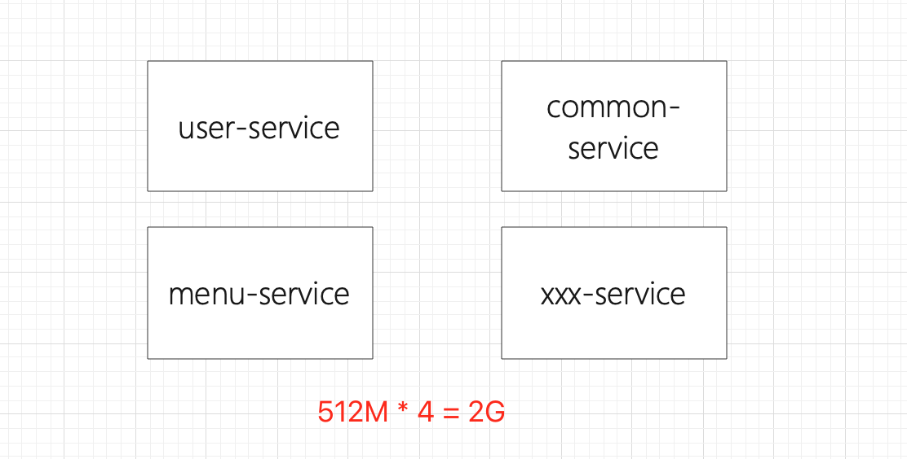
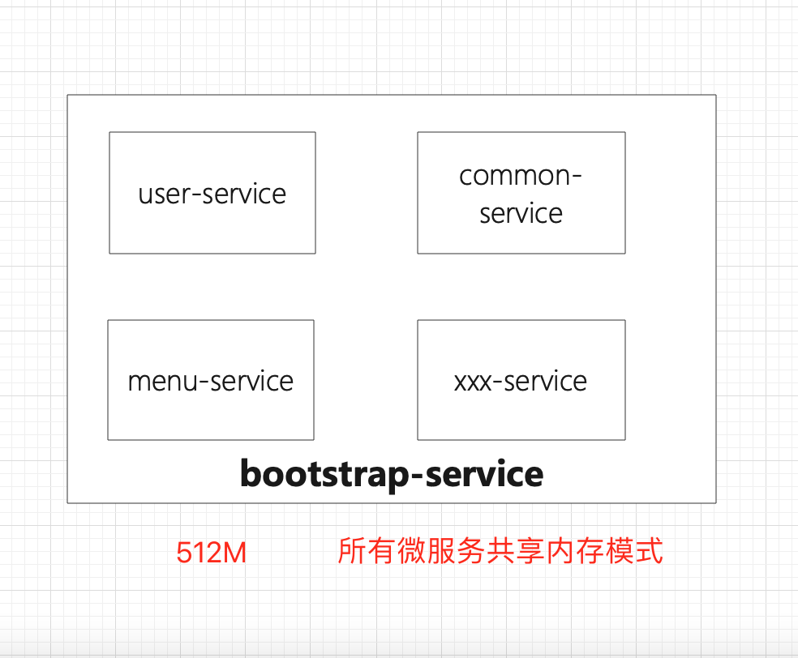
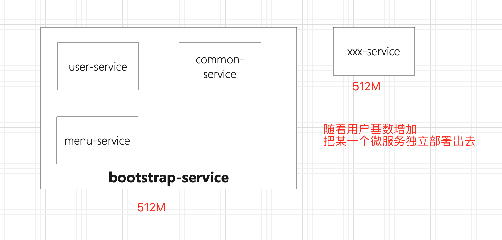

### 1. 背景
1) 按照DDD的思想,每一个限界上下文为一个微服务.   
2) 大家都在推行SASS化,但是,有租户想要做到独立部署,资源应该如何分配?

### 2. 微服务带来的资源浪费问题
1) 微服务之后,内存无法无法得到合理的使用(512M * 20个微务=10G).  
2) 独立部署成本较高,而,实际租户的用户基数和数据量都是随着时间而增长的.        

### 3. 需要注意的事项
1) 开发依然按照DDD的思想进行微服务的划分.  
2) 不能为了解决这个问题,而,影响开发的效率,增加开发的学习成本.         

### 4. 如何解决?
1) OSGI是个好东西,可惜就是太重了,需要增加开发的学习成本.   
2) 蚂蚁金服也遇到了相同的问题,所以,开源了Jarslink,但是,Jarslink目前不支持SpringBoot.  
3) OSGI太重,而Jarslink又不适用于SpringBoot,那么,为何不学习下Jarslink的思想,自己实现一套呢?                

### 5. Jarslink的思想是什么
Jarlink的思想比较简单: 
1) 每一个微服务(fast jar),通过一个独立的ClassLoader加载,并且,通过Spring来加载这个ClassLoader的内容.   
2) 这样,可以让所有的微服务都独立在自己的ClassLoader里(互不干扰).  
3) 热部署时,只要让ClassLoader和Spring Context销毁/重新加载即可.   
4) 通过以上思路,即可解决,从单体转向微服务之后,内存资源利用低的问题.  

### 6. 部署演示图
  
  
  

### 7. 架构图
